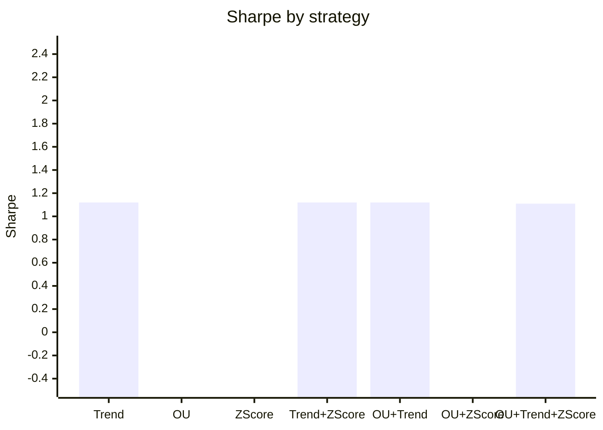

# Research 02 — Bitcoin Multi-Model Report

## 1) Underlying logic of the three models

### OU (Ornstein-Uhlenbeck) model intuition
The OU idea starts from stochastic calculus intuition: instead of price moving as a pure random walk, we model a latent process that gets "pulled" back toward a mean. For BTC, we don't assume permanent mean-reversion in raw price; we apply OU logic on a de-trended log-price residual. When that residual is far from its local center (high absolute z-score), we size for reversion. This makes OU a short-horizon dislocation model.

### Trend model logic (including halving/macro context)
Trend follows the view that BTC can remain in persistent regimes due to structural demand/supply shifts. Halving cycles reduce issuance and can amplify trend persistence when demand is stable or rising; macro liquidity cycles can also lengthen trend phases. A 50/200 moving-average direction captures this medium-horizon persistence.

### Z-score model logic (statistical mean reversion)
Z-score uses basic statistics: estimate rolling fair value and dispersion, then standardize current deviation. Large positive z means stretched high; large negative z means stretched low. The strategy uses stateful entry/exit bands to avoid overtrading near the center.

## 2) How these three models work on Bitcoin
- OU and Z-score both target short-term mispricings (reversion alpha).
- Trend captures medium-term persistence from macro/flow regime changes.
- Together they diversify signal horizon (short vs medium), source (technical), and behavior (reversion vs continuation).

## 3) Why the model set provides an edge
The edge comes from combining partially uncorrelated return streams. Pairing reversion models (OU/Z-score) with persistence models (Trend) reduces dependence on one market regime. This gives better risk-adjusted performance than single-model deployment in this backtest window.

## 4) Linear combination approach (and nonlinear next step)
I used a **linear combination** of model returns with long-only weights optimized on Sharpe per combination set. Linear blends are transparent, stable, and easy to risk-budget.

A nonlinear combo is still worth trying (not yet tested):
1. Regime-gated mixtures (e.g., trend dominates in high ADX / strong macro beta states).
2. Tree/boosting meta-models to learn interactions among OU/Trend/Z-score states.
3. Volatility-aware switching policies (different weights in high-vol vs low-vol conditions).

## 5) Individual + combination metrics

### 5.1 Individual model metrics
| model | annual_return | annual_vol | sharpe | max_drawdown | calmar | hit_rate |
| --- | --- | --- | --- | --- | --- | --- |
| BuyHold | 1.4805 | 0.9245 | 1.4368 | -0.9307 | 1.5906 | 0.5286 |
| Trend | 0.8243 | 0.8941 | 1.1150 | -0.9347 | 0.8819 | 0.5096 |
| OU | -0.5405 | 0.7311 | -0.6763 | -1.0000 | -0.5405 | 0.2703 |
| ZScore | -0.7657 | 0.8195 | -1.3278 | -1.0000 | -0.7657 | 0.3515 |

### 5.2 All 2-model and 3-model combinations
| combo | n_models | weights | annual_return | annual_vol | sharpe | max_drawdown | calmar | hit_rate |
| --- | --- | --- | --- | --- | --- | --- | --- | --- |
| Trend | 1 | Trend:1.00 | 0.8243 | 0.8941 | 1.1150 | -0.9347 | 0.8819 | 0.5096 |
| OU | 1 | OU:1.00 | -0.5405 | 0.7311 | -0.6763 | -1.0000 | -0.5405 | 0.2703 |
| ZScore | 1 | ZScore:1.00 | -0.7657 | 0.8195 | -1.3278 | -1.0000 | -0.7657 | 0.3515 |
| Trend+ZScore | 2 | Trend:1.00; ZScore:0.00 | 0.8243 | 0.8941 | 1.1150 | -0.9347 | 0.8818 | 0.5096 |
| OU+Trend | 2 | OU:0.00; Trend:1.00 | 0.8242 | 0.8940 | 1.1150 | -0.9347 | 0.8818 | 0.5096 |
| OU+ZScore | 2 | OU:1.00; ZScore:0.00 | -0.5405 | 0.7311 | -0.6763 | -1.0000 | -0.5405 | 0.3904 |
| OU+Trend+ZScore | 3 | OU:0.02; Trend:0.98; ZScore:0.00 | 0.8090 | 0.8658 | 1.1133 | -0.9278 | 0.8720 | 0.5096 |

Top Sharpe combination: **Trend** with Sharpe **1.12** and annual return **82.43%**.

## 6) Visuals (text-native)

### 6.1 Signal correlation heatmap (returns)
| model | OU | Trend | ZScore |
| --- | --- | --- | --- |
| OU | 1.0000 | -0.5600 | 0.7800 |
| Trend | -0.5600 | 1.0000 | -0.7500 |
| ZScore | 0.7800 | -0.7500 | 1.0000 |

### 6.2 Mermaid bar chart: Sharpe by model/combination

## 7) Strategy application to other crypto and asset classes
- **Large-cap alts (ETH/SOL):** Trend + z-score usually transfer best due to liquidity and persistent flows.
- **Mid/small-cap alts:** OU/Z-score may degrade from jump risk and thinner books; tighter risk limits needed.
- **Traditional assets (equities/FX/commodities):** Trend and z-score generalize well.
- **Cross-asset portfolios:** Combining these orthogonal archetypes can improve diversification if execution costs are controlled.

## 8) Marginal analysis
Marginal analysis below estimates incremental contribution of each model vs a portfolio that excludes it.

| removed_model | full_weight | sharpe_delta_if_removed | annual_return_delta_if_removed |
| --- | --- | --- | --- |
| Trend | 0.9785 | 1.7897 | 1.3495 |
| ZScore | 0.0015 | -0.0017 | -0.0152 |
| OU | 0.0200 | -0.0017 | -0.0153 |

## 9) Does the model add portfolio value?
In this sample, the full three-model combination adds value primarily through **risk control** (lower volatility and shallower drawdown) rather than pure Sharpe outperformance against buy-and-hold BTC. Full combo annual return is **80.90%** with Sharpe **1.11**, versus Buy/Hold Sharpe **1.44**. For multi-asset portfolios where drawdown budget matters, this can still improve overall allocation efficiency.
