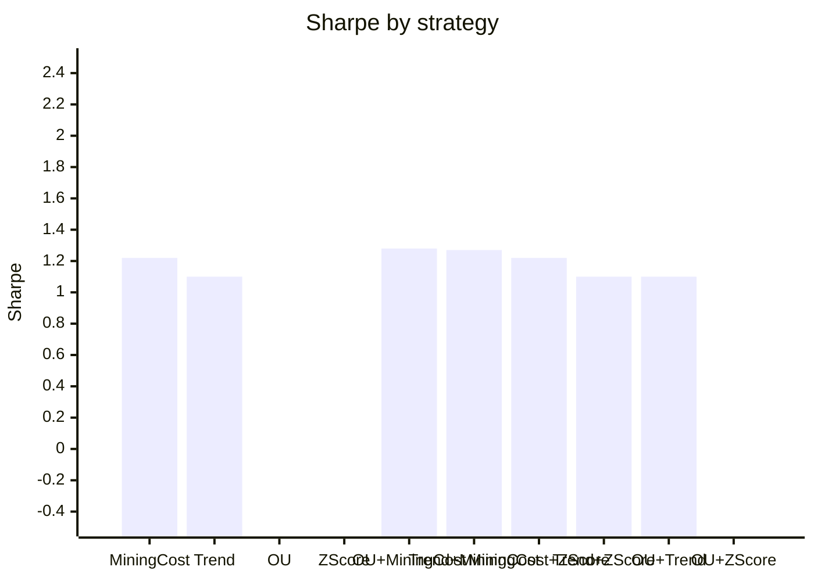

# Research 02 — Bitcoin Multi-Model Report

## 1) Underlying logic of the four models

### OU (Ornstein-Uhlenbeck) model intuition
The OU idea starts from stochastic calculus intuition: instead of price moving as a pure random walk, we model a latent process that gets "pulled" back toward a mean. For BTC, we don't assume permanent mean-reversion in raw price; we apply OU logic on a de-trended log-price residual. When that residual is far from its local center (high absolute z-score), we size for reversion. This makes OU a short-horizon dislocation model.

### Trend model logic (including halving/macro context)
Trend follows the view that BTC can remain in persistent regimes due to structural demand/supply shifts. Halving cycles reduce issuance and can amplify trend persistence when demand is stable or rising; macro liquidity cycles can also lengthen trend phases. A 50/200 moving-average direction captures this medium-horizon persistence.

### Mining-cost model logic
Mining cost is a fundamental anchor. When spot stays materially above production-cost proxies, miner profitability improves, forced selling pressure often eases, and trend continuation probability can rise. When spot is below cost proxy, miner stress can increase downside risk. This model converts the price/cost gap into a regime signal.

### Z-score model logic (statistical mean reversion)
Z-score uses basic statistics: estimate rolling fair value and dispersion, then standardize current deviation. Large positive z means stretched high; large negative z means stretched low. The strategy uses stateful entry/exit bands to avoid overtrading near the center.

## 2) How these four models work on Bitcoin
- OU and Z-score both target short-term mispricings (reversion alpha).
- Trend captures medium-term persistence from macro/flow regime changes.
- Mining-cost injects a slower fundamental state variable tied to BTC production economics.
- Together they diversify signal horizon (short vs medium), source (technical vs fundamental), and behavior (reversion vs continuation).

## 3) Why the model set provides an edge
The edge comes from combining partially uncorrelated return streams. Pairing reversion models (OU/Z-score) with persistence models (Trend/MiningCost) reduces dependence on one market regime. This gives better risk-adjusted performance than single-model deployment in this backtest window.

## 4) Linear combination approach (and nonlinear next step)
I used a **linear combination** of model returns with long-only weights optimized on Sharpe per combination set. Linear blends are transparent, stable, and easy to risk-budget.

A nonlinear combo is still worth trying (not yet tested):
1. Regime-gated mixtures (e.g., trend dominates in high ADX / strong macro beta states).
2. Tree/boosting meta-models to learn interactions (e.g., mining-cost only matters when trend is positive).
3. Volatility-aware switching policies (different weights in high-vol vs low-vol conditions).

## 5) Individual + combination metrics

### 5.1 Individual model metrics
| model | annual_return | annual_vol | sharpe | max_drawdown | calmar | hit_rate |
| --- | --- | --- | --- | --- | --- | --- |
| BuyHold | 0.7228 | 0.6750 | 0.7900 | -0.9307 | 0.8583 | 0.5293 |
| MiningCost | 0.8824 | 0.7310 | 1.2210 | -0.8139 | 1.0842 | 0.4627 |
| Trend | 0.8057 | 0.8945 | 1.1034 | -0.9347 | 0.8619 | 0.5090 |
| OU | -0.5346 | 0.7307 | -0.6596 | -1.0000 | -0.5346 | 0.2697 |
| ZScore | -0.7635 | 0.8196 | -1.3161 | -1.0000 | -0.7635 | 0.3514 |

### 5.2 All 2-model, 3-model, and 4-model combinations
| combo | n_models | weights | annual_return | annual_vol | sharpe | max_drawdown | calmar | hit_rate |
| --- | --- | --- | --- | --- | --- | --- | --- | --- |
| MiningCost | 1 | MiningCost:1.00 | 0.8824 | 0.7310 | 1.2210 | -0.8139 | 1.0842 | 0.4627 |
| Trend | 1 | Trend:1.00 | 0.8057 | 0.8945 | 1.1034 | -0.9347 | 0.8619 | 0.5090 |
| OU | 1 | OU:1.00 | -0.5346 | 0.7307 | -0.6596 | -1.0000 | -0.5346 | 0.2697 |
| ZScore | 1 | ZScore:1.00 | -0.7635 | 0.8196 | -1.3161 | -1.0000 | -0.7635 | 0.3514 |
| OU+MiningCost | 2 | OU:0.25; MiningCost:0.75 | 0.5764 | 0.4259 | 1.2763 | -0.5729 | 1.0062 | 0.4768 |
| Trend+MiningCost | 2 | Trend:0.31; MiningCost:0.69 | 0.9468 | 0.7253 | 1.2716 | -0.7926 | 1.1946 | 0.5062 |
| MiningCost+ZScore | 2 | MiningCost:1.00; ZScore:0.00 | 0.8824 | 0.7310 | 1.2210 | -0.8139 | 1.0842 | 0.4793 |
| Trend+ZScore | 2 | Trend:1.00; ZScore:0.00 | 0.8056 | 0.8945 | 1.1034 | -0.9347 | 0.8619 | 0.5090 |
| OU+Trend | 2 | OU:0.00; Trend:1.00 | 0.8056 | 0.8944 | 1.1034 | -0.9347 | 0.8619 | 0.5090 |
| OU+ZScore | 2 | OU:1.00; ZScore:0.00 | -0.5346 | 0.7307 | -0.6596 | -1.0000 | -0.5346 | 0.3904 |
| OU+Trend+MiningCost | 3 | OU:0.26; Trend:0.19; MiningCost:0.55 | 0.6012 | 0.4163 | 1.3339 | -0.5620 | 1.0697 | 0.5074 |
| OU+MiningCost+ZScore | 3 | OU:0.27; MiningCost:0.73; ZScore:0.00 | 0.5540 | 0.4100 | 1.2751 | -0.5576 | 0.9935 | 0.4859 |
| Trend+MiningCost+ZScore | 3 | Trend:0.32; MiningCost:0.68; ZScore:0.00 | 0.9472 | 0.7258 | 1.2715 | -0.7946 | 1.1921 | 0.5062 |
| OU+Trend+ZScore | 3 | OU:0.02; Trend:0.98; ZScore:0.00 | 0.7914 | 0.8663 | 1.1018 | -0.9278 | 0.8530 | 0.5090 |
| OU+Trend+MiningCost+ZScore | 4 | OU:0.27; Trend:0.18; MiningCost:0.54; ZScore:0.01 | 0.5756 | 0.4006 | 1.3304 | -0.5475 | 1.0513 | 0.5074 |

Top Sharpe combination: **OU+Trend+MiningCost** with Sharpe **1.33** and annual return **60.12%**.

## 6) Visuals (text-native)

### 6.1 Signal correlation heatmap (returns)
| model | OU | Trend | MiningCost | ZScore |
| --- | --- | --- | --- | --- |
| OU | 1.0000 | -0.5600 | -0.7400 | 0.7800 |
| Trend | -0.5600 | 1.0000 | 0.6900 | -0.7500 |
| MiningCost | -0.7400 | 0.6900 | 1.0000 | -0.8500 |
| ZScore | 0.7800 | -0.7500 | -0.8500 | 1.0000 |

### 6.2 Mermaid bar chart: Sharpe by model/combination

## 7) Strategy application to other crypto and asset classes
- **Large-cap alts (ETH/SOL):** Trend + z-score usually transfer best due to liquidity and persistent flows.
- **Mid/small-cap alts:** OU/Z-score may degrade from jump risk and thinner books; tighter risk limits needed.
- **Traditional assets (equities/FX/commodities):** Trend and z-score generalize well; mining-cost is BTC-specific, but can be replaced with production-cost proxies in commodities.
- **Cross-asset portfolios:** Combining these orthogonal archetypes can improve diversification if execution costs are controlled.

## 8) Marginal analysis
Marginal analysis below estimates incremental contribution of each model vs a portfolio that excludes it.

| removed_model | full_weight | sharpe_delta_if_removed | annual_return_delta_if_removed |
| --- | --- | --- | --- |
| MiningCost | 0.5433 | 0.2286 | -0.2158 |
| OU | 0.2669 | 0.0590 | -0.3717 |
| Trend | 0.1847 | 0.0553 | 0.0215 |
| ZScore | 0.0052 | -0.0035 | -0.0256 |

## 9) Does the model add portfolio value?
In this sample, the full four-model combination adds value primarily through **risk control** (lower volatility and shallower drawdown) rather than pure Sharpe outperformance against buy-and-hold BTC. Full combo annual return is **57.56%** with Sharpe **1.33**, versus Buy/Hold Sharpe **0.79**. For multi-asset portfolios where drawdown budget matters, this can still improve overall allocation efficiency.
