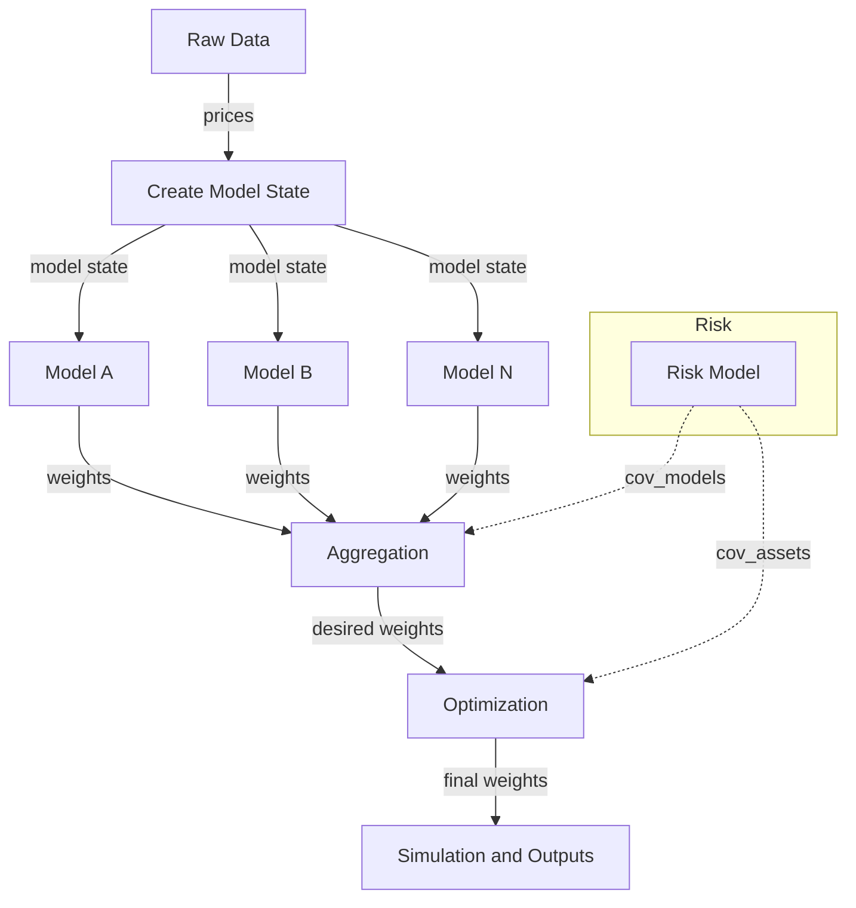

### Trading Engine: Architecture and Process Flow

This package provides a Polars‑centric, multi‑strategy pipeline. It transforms raw OHLCV data into model signals, aggregates those signals into desired portfolio weights, optionally optimizes those weights using asset risk models, and simulates results end‑to‑end.

## End‑to‑End Flow
```text
Raw Data → Model State → Models → Aggregation → (optional) Optimization → Simulation/Outputs
```



- **Data → Model State**
  - Read lazy price data and compute features into a tidy table (model state).
  - File: `trading_engine/core.py` → `read_data`, `create_model_state`.

- **Model Signals**
  - Each model consumes a subset of the model state and outputs daily weights per traded ticker.
  - Registry: `trading_engine/models/registry.py` (maps names → callables + input spec).
  - Contract: returns wide `['date', <tickers...>]`, weights in [-1, 1].

- **Aggregation (model‑wise)**
  - Combine per‑model weights into a single desired portfolio (e.g., equal‑weight, drawdown‑aware).
  - Registry: `trading_engine/aggregators/registry.py`.
  - Contract: input `{model_name: LazyFrame}` → one wide weights table. Orchestrator handles float coercion, universe padding, clamping, and L1 budget.

- **Optimization (asset‑level, optional)**
  - Refine aggregated weights using an asset risk model (covariances) to produce final portfolio weights.
  - Registry: `trading_engine/optimizers/registry.py`.
  - Contract: input `(prices_df, desired_weights_df, config)` → wide `LazyFrame`. Orchestrator applies clamp/L1.

- **Simulation**
  - Turn prices + weights into backtest results and summary metrics (`HawkBacktester`).

## Orchestration (Wiring)
File: `trading_engine/core.py`
- `read_data(include_supplemental=False)`: legacy default returns primary `LazyFrame`; with `True` returns `RawDataBundle`.
- `create_model_state`: legacy default returns `(model_state, prices)`; bundle mode returns `(ModelStateBundle, prices)`.
- `orchestrate_model_backtests`: supports both runner contracts:
  - legacy (default): model receives filtered `LazyFrame`
  - bundle (opt-in): set `"input_mode": "bundle"` in model registry entry
  - auto fallback: when `input_mode` is omitted, runner signature is inferred (`bundle` arg / `ModelStateBundle` annotation)
- `orchestrate_model_simulations`: simulate each model’s standalone portfolio.
- `orchestrate_portfolio_aggregation`: apply aggregators; central clamp + L1.
- `orchestrate_portfolio_optimizations` (optional): apply optimizers; central post‑processing.
- `orchestrate_portfolio_simulations`: simulate aggregated/optimized portfolios.
- `run_full_backtest`: one‑shot entry that returns all artifacts.

## Quick Developer Guide (Old vs New)
| Area | Old setup | New setup |
|---|---|---|
| Raw input | `lf = read_data()` | `raw_data_bundle = read_data(include_supplemental=True)` |
| Model state | `model_state, prices = create_model_state(lf=...)` | `model_state_bundle, prices = create_model_state(raw_data_bundle=..., return_bundle=True)` |
| Model runner input | `Callable[[LazyFrame], LazyFrame]` | `Callable[[ModelStateBundle], LazyFrame]` |
| Registry hint | none | optional `"input_mode": "bundle"` |

Why this is important:
- Keeps current model development stable (legacy models still run as-is).
- Enables gradual migration to supplemental/non-ticker data without a big-bang rewrite.
- Lets new models use richer context (`supplemental_model_state`) while old models continue shipping.

Minimal examples:
```python
# Old (still supported)
lf = read_data()
model_state, prices = create_model_state(
    lf=lf, features=features, start_date=start_date, end_date=end_date, universe=universe
)
model_insights = orchestrate_model_backtests(
    model_state=model_state, models=models, universe=universe
)
```

```python
# New (bundle path)
raw_data_bundle = read_data(include_supplemental=True)
model_state_bundle, prices = create_model_state(
    raw_data_bundle=raw_data_bundle,
    features=features,
    start_date=start_date,
    end_date=end_date,
    universe=universe,
    return_bundle=True,
)
model_insights = orchestrate_model_backtests(
    model_state_bundle=model_state_bundle, models=models, universe=universe
)
```

## Components at a Glance
| Directory | Purpose | Registry |
|---|---|---|
| `trading_engine/models/` | Model signal generators | `models/registry.py` |
| `trading_engine/aggregators/` | Combine model signals into desired weights | `aggregators/registry.py` |
| `trading_engine/optimizers/` | Refine desired weights using risk models | `optimizers/registry.py` |
| `trading_engine/risk/` | Covariance and risk model providers | `risk/registry.py` |
| `trading_engine/core.py` | Orchestration helpers and full pipeline | — |

## Data & Weight Conventions
- **Shape**: wide tables with `date` (string) + tickers (universe order).
- **Post‑processing**: orchestrator clamps to [-1, 1] and applies an L1 budget to keep components simple and consistent.
- **Alignment**: orchestrator pads/drops/reorders tickers to match the configured universe.

## Configuration & Production
- **Config**: `src/production/paper/config.yaml`
  - **keys**: `model_state_features`, `models`, `aggregators`, optional `portfolio_optimizers`, `universe`, `start_date`, `end_date`.
- **Entrypoint**: `src/production/paper/main.py`
  - Runs the full pipeline, persists artifacts (e.g., to GCS), and prepares execution instructions.

## Extending the System
- **Add a model**: implement under `models/catalogue/`, register in `models/registry.py`.
  - Legacy model: keep current `LazyFrame` signature (no extra registry flags).
  - Bundle model (new): use `ModelStateBundle` signature and set `"input_mode": "bundle"` in registry.
- **Add an aggregator**: implement under `aggregators/catalogue/`, register in `aggregators/registry.py`.
- **Add an optimizer**: implement under `optimizers/catalogue/`, register in `optimizers/registry.py`.
- **Add a risk model**: implement under `risk/catalogue/`, register in `risk/registry.py`.

## Research Usage
- Notebook: `src/research/04_quickstart_v2.ipynb` (end‑to‑end v2 quickstart).
- Prefer `run_full_backtest` for a single‑call pipeline with explicit inputs.

## Optimizers (Purpose)
- Optimizers take aggregated, model‑wise desired weights and refine them using an asset‑level risk model (e.g., covariance), balancing expected return, risk, and optional tracking to the aggregated portfolio. Result: a risk‑aware final portfolio that preserves the core signal structure.

## Notes & Assumptions
- **Global clamps/budget** are applied centrally after aggregation/optimization. Component‑specific constraints (e.g., long‑only) can be added per component or via registry flags.
- **Risk inputs** use daily log returns and rolling windows by default; alternate horizons/frequencies can be added via the risk registry.
